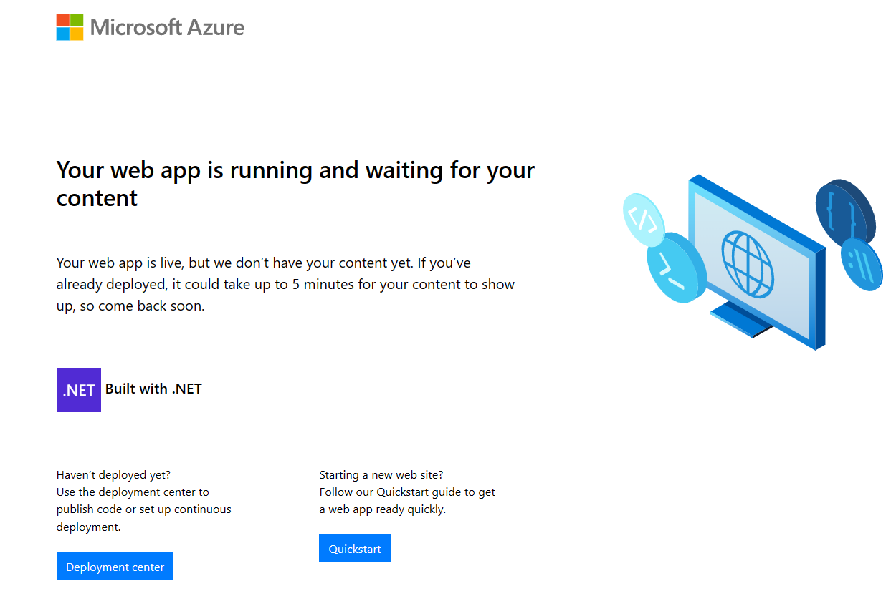

# Cloud Native/App Service lab
Following the plan [here](https://learn.microsoft.com/en-us/azure/app-service/quickstart-dotnetcore?tabs=net70&pivots=development-environment-vscode)

## Prerequities
1. An Azure account with an active subscription.
2. Visual Studio Code.
3. The Azure Tools extension.
4. The latest .NET 7.0 SDK.

**Align with Simon on this **

## Step One - understanding web apps
Cover:
1. App Service is the umbrella terms of web apps, web app for containers, APIs etc.
2. platform as a service - managed service - what that means
3. Fastest way to get some web capability running
4. Cares little about the programming language or runtime
5. TLS out of the box (not so with all other compute services)
6. Deploying the web app and deploying its code are two separate things - each with their own lifecycle. Deploying the code must be after the web app and is usually done much more frequently.

## Step Two - verify your app can run locally
This should be done in your local copy of Visual Studio Code and should be covered from the previous session. 
Make sure your application is up and running locally.

## Step Three - create a web app in the portal
This step is peformed in the Azure portal.

Steps:
1. type "web app" in the search part of the portal
2. Choose the "App Services" item in the search results

3. Choose "Create" then "Web App"

   
4. You should then choose some suitable values for the web app. The name must be unique. 

Things to think about:
* It's name
* Resource Group
* Region
* Service plan - Windows or Linux and SKU
* Runtime

5. Hit the "Create" button and then wait a few minutes.

You should now have a web application in the portal. This is now a public-facing live web site with the URL https://YOUR_WEB_APP_NAME.azurewebsites.net.

Try putting that in a browser session (with your web app name). You should see something like this:

If this is the case, then the web app exists and is running. All we have to do now it to put our own code on the web app so that it is a real application.

## Step Four Deploy/Publish from VS Code to the web app
This step is back in Visual Studio Code (VS Code).

In this step we are going to deploy directly from VS Code. In production, this would not normally done this way, but would be done in some automated manner in the likes of GitHub or Azure DevOps. This will be a later lab.

However, it is sometimes useful to directly deploy from VS Code.

Your copy of VS Code should already have the application code and also should have an "Azure" extension installed.

The Azure extension needs to be logged onto your Azure subscription.

Once logged on, pick the Azure extension

## Step Five make a change and redeploy

## Stretch goal
1. container
2. deployment slot
3. authentication
4. 
